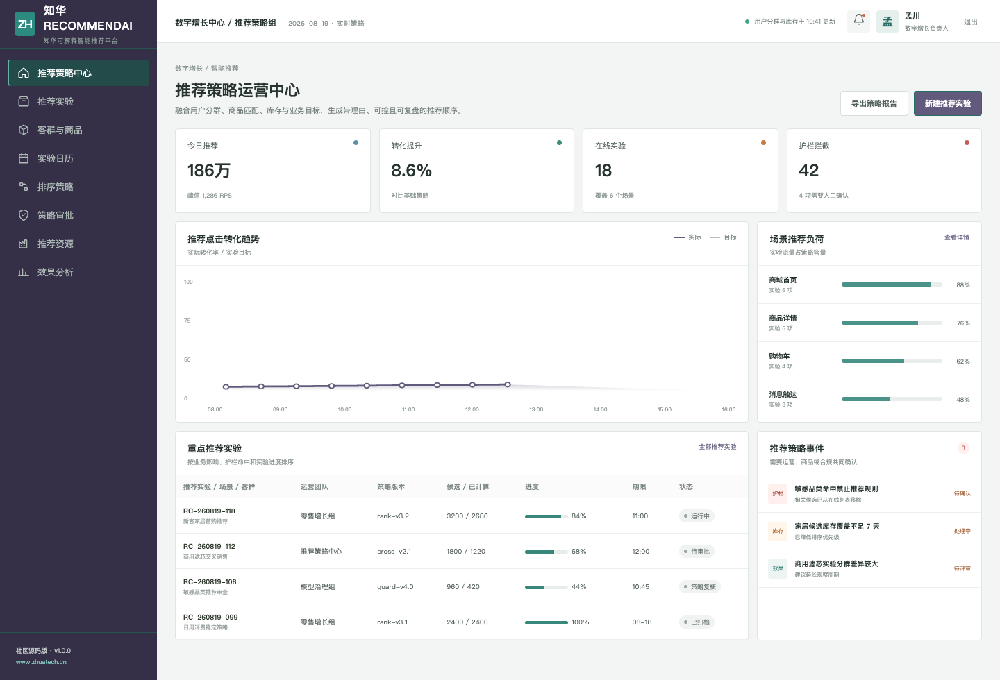
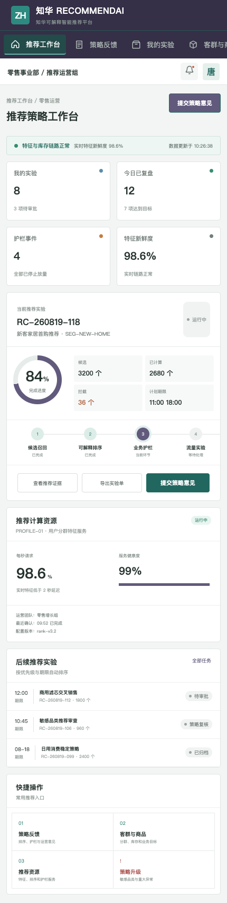

# RecommendAI

**知华可解释智能推荐平台 · Java + Vue 社区源码版**

由[知华科技（上海如静知华信息科技有限公司）](https://www.zhuatech.cn/)发布。

RecommendAI 不是“只追求点击率”的推荐黑盒。它将用户分群匹配、业务优先级、可售库存、商品毛利、近期重复购买与受限品类放到同一个排序过程，并为每个候选返回推荐分、位置、理由和安全护栏结论。



## 为什么强调可解释与可控

- 候选商品可以返回 `RECOMMEND / EXPLORE / HOLD / EXCLUDE`
- 库存不足自动降级，零库存直接排除
- 近期已购买商品进入冷却处理
- 受限品类禁止自动推荐，并保留人工复核标识
- 策略版本、流量实验和结果复盘都有审计记录

参考接口：`POST /api/ai/recommend/rank`。社区版不需要外部 AI API Key。



## 开箱内容

管理端包含推荐场景、客群商品、实验日历、排序策略、策略审批、资源状态与效果分析；H5 端提供实验任务、策略反馈、护栏升级和实时服务状态。

技术栈：Java 21、Spring Boot 4、JPA、MySQL 8、Flyway、JWT、Vue 3、Pinia、Vite、Docker Compose、JUnit 与 MockMvc。包名为 `cn.zhuatech.recommendai`。

```bash
cd frontend
npm install
npm run dev:demo
```

打开 `http://localhost:5173`，管理端 `planner / Demo@2026`，运营端 `operator / Demo@2026`。所有用户分群、商品、指标与人员均为虚构演示内容。

查看：[API 文档](docs/api.md) · [架构说明](docs/architecture.md) · [数据库](docs/database.md) · [部署](deploy/README.md)

## 使用边界与合作

本工程仅限个人、非商业学习交流，**不得商用**。企业内部使用、生产部署、SaaS、实施交付、品牌替换、收费服务和商业再发行须取得上海如静知华信息科技有限公司书面授权，以 [LICENSE](LICENSE) 为准。

需要推荐系统、用户画像/CDP、商城集成、AI 私有化、FDE 或软件项目外包，请访问[知华科技官网](https://www.zhuatech.cn/)或扫码咨询：

| 技术方案咨询 | 授权与项目定制 |
| --- | --- |
|  |  |

SEO：推荐系统、可解释推荐、商品推荐 AI、个性化推荐、Java 推荐系统源码、知华科技。
